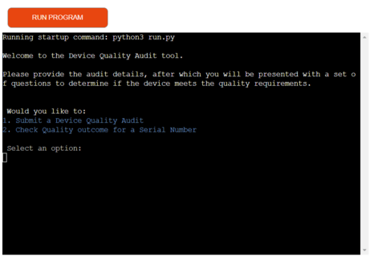
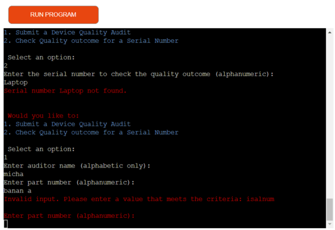
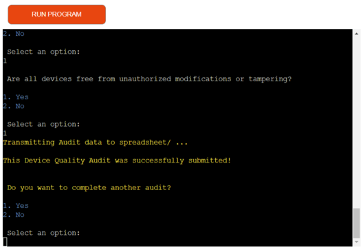
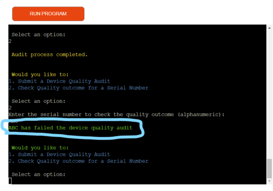
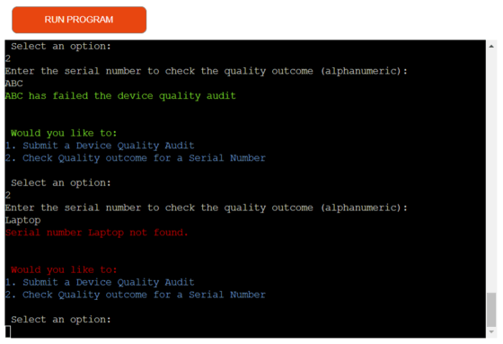
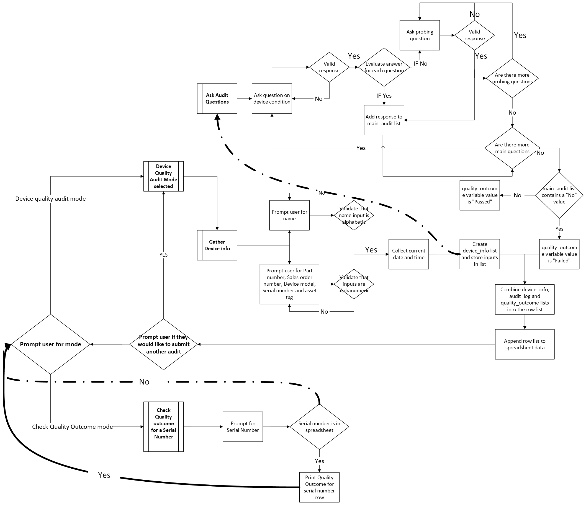

# **Device Quality Audit Tool**

 

# Overview
The Device Quality Audit Tool is designed for production quality supervisors and their teams at IT equipment resellers. This tool collects device quality audit reports for laptops and desktops undergoing configuration, modification, and installation processes. The collected data is validated and stored in a Google spreadsheet, ensuring data integrity and facilitating report generation by management. Additionally, the tool allows users to check the quality outcome of previously submitted audit reports based on the serial number of the device.

You can access the tool through the following link: <a href="https://device-quality-audit-3500f8503e72.herokuapp.com/" target="_blank"> Device Quality Audit </a>

The spreadsheet where the data is written into can be access through <a href="https://docs.google.com/spreadsheets/d/142YUxspbdLPVlbAbR9dHFEMEsQg8Ie459hkIRFsqVL8/edit?usp=drive_link" target="_blank"> This google drive link </a>

# Contents

- [Device Quality Audit Tool](#device-quality-audit-tool)
- [Overview](#overview)
- [Table of Contents](#table-of-contents)
- [Objective](#objective)
- [Target Audience](#target-audience)
- [User Stories](#user-stories)
- [Usage](#usage)
   * [Submit a Device Quality Audit](#submit-a-device-quality-audit)
   * [Retrieving Quality Outcomes](#retrieving-quality-outcomes)
- [Features](#features)
- [Future features](#future-features)
- [Flowchart](#flowchart)
- [Installation](#installation)
   * [Clone the repository:](#clone-the-repository)
   * [Install dependencies:](#install-dependencies)
   * [Set up Google API credentials:](#set-up-google-api-credentials)
   * [Configuration](#configuration)
- [Deployment](#deployment)
- [Technologies Used ](#technologies-used)
- [Testing](#testing)
   * [Validation](#validation)
   * [Spreadsheet testing](#spreadsheet-testing)
   * [User input testing](#user-input-testing)
   * [Bugs](#bugs)
- [Credits & Acknowledgements](#credits-acknowledgements)

# Objective

This project is intended to replace the current production practise of submitting quality audit data in an unorganized manner where data is directly entered into a spreadsheet without uniform formatting or data validation. It offers the quality team a structured way to provided clear answers through targetted questioning of the device's quality and compliance parameters. This in turn provides a clean and organized data output which can be used for analysis and reporting.

[Back to top](<#contents>)

# Target Audience

The Device Quality Audit Tool is specifically designed for:

- **Production Quality Supervisors:** Overseers of the quality control process who require a reliable method to document and review device audits systematically.
- **Quality Assurance Teams:** Team members responsible for ensuring that laptops and desktops meet the required quality standards before they are distributed.
- **IT Equipment Resellers:** Businesses that modify, configure, and install IT equipment, needing an efficient way to manage and validate audit data.
- **Management:** Decision-makers who utilize audit reports generated from the collected data to assess and improve quality control processes.

[Back to top](<#contents>)

# User Stories
- As a Production Quality Supervisor:

    I want to ensure that all device quality audits are completed accurately and efficiently.
    So that I can maintain high standards and consistency in our quality control processes.

- As a Quality Assurance Team Member:

    I want a user-friendly tool to input audit data with validation checks.
    So that I can reduce the likelihood of errors and streamline the audit process.

- As an IT Equipment Reseller:

    I want a centralized system to store and manage all audit data.
    So that I can easily access and review audit outcomes to ensure compliance with quality standards.

- As a Manager:

    I want to generate comprehensive reports based on the collected audit data.
    So that I can analyze performance and identify areas for improvement.

- As a Staff Member:

    I want to quickly check the quality outcome of a specific device by entering its serial number.
    So that I can provide accurate information to stakeholders and customers promptly.

[Back to top](<#contents>)

# Usage

Upon starting, you will be greeted with the following message:

        Welcome to the Device Quality Audit tool.

        Please provide the audit details, after which you will be presented with a set of questions to determine if the device meets the quality requirements.

        Would you like to:
        1. Submit a Device Quality Audit
        2. Check Quality outcome for a Serial Number

        Select an option:

## Submit a Device Quality Audit

Enter "1" to choose "Submit a Device Quality Audit".

You will be prompted to enter the following information:

        Enter auditor name (alphabetic only):
        Enter part number (alphanumeric):
        Enter sales order number (alphanumeric):
        Enter device model (alphanumeric):
        Enter serial number (alphanumeric):
        Enter asset tag (alphanumeric):

The tool will then guide you through a series of questions about the device being audited.

When an invalid value is entered into the mock terminal, the validation will throw a warning and you'll be asked to provided a response again.

Example question

        Is the packaging of the laptops and desktops intact/undamaged?
        1. Yes
        2. No

The audit has 12 main questions, if these questions are answered with a "No" then you will be asked probing questions to determine the nature of the issue.
Once all questions have been answered the Quality Audit data will be submitted and written into the spreadsheet.

 

After completing an audit, you can choose to submit another audit or return to the main menu.

## Retrieving Quality Outcomes

When on the main menu, enter "2" to choose "Check Quality outcome for a Serial Number".
You will be prompted to enter a serial number:

        Enter the serial number to check the quality outcome (alphanumeric):

The tool will retrieve and display the quality outcome (passed/failed) for the specified serial number.

 

When a serial number is entered that does not have an Audit report completed yet, the mock terminal will inform the user and return to the main menu.

 

[Back to top](<#contents>)

# Features

- **Device Quality Audit:** Collects detailed audit information, validates inputs, and stores data in a Google spreadsheet.
- **Quality Outcome Retrieval:** Allows users to check the audit result (passed/failed) for a specific device using its serial number.
- **User-Friendly Interface:** Guides users through the audit process and provides clear feedback on data entry.

# Future features

- **Duplicate Serial Numbers:** Check the spreadsheet to see if an audit was previously submitted for the same serial number, overwrite the previous serial number with the new audit data.
- **Asset Tag for Outcome Retrieval:** Check quality outcome by searching datasheet for asset tag inputs.

[Back to top](<#contents>)

# Flowchart

 

[Back to top](<#contents>)

# Installation

## Clone the repository:

        git clone https://github.com/mhesemans/device-quality-audit.git
        cd device-quality-audit

## Install dependencies:

        pip install -r requirements.txt

## Set up Google API credentials:

Obtain your creds.json file and place it in the root directory of the project. This file contains your Google API credentials.

Steps to create your creds.json file

- Log into your google account and access https://console.cloud.google.com/welcome/
- Click on the "Select a new project" button
- Select "New Project"
- Enter your project name and click "Create"
- Select the project
- Select APIs & Services from the side menu and select library
- Enter "Google Drive" into the search bar that appeared in the middle of your screen
- Select the top option which should be "Google Drive API"
- Click on the "enable" button
- Click on the "Create Credentials" button once the next sceen loads
- In the dropdown menu for "Which API are you using?" question, select Google Drive API
- For the "What data will you be accessing?" question, tick the "Application data" radio button
- For the next question on Compute Engine etc. select "No, I'm not using them" and click next
- Enter the Service account name and click the "Create" button
- Next for the service account access, select "Basic" and "Editor" in the role dropdown menu, then click on the "continue" button
- On the next screen, select "Done"
- Click on the service account that has been created and open the "Keys" tab
- Select "Create new key" in the "Add key" dropdown menu
- Select JSON and click on Create

 
Once these steps have been completed, the JSON file will be downloaded onto your computer, rename the file that was downloaded to "creds.json"

## Configuration

- **Google Sheets Integration:** The tool requires access to a Google Sheet named device_quality_audit. Ensure the sheet has an audit worksheet for storing audit data.
- **Spreadsheet Columns:** Please ensure the first row in your spreadsheet has the following columns:

 Spreadsheet Columns 

["Auditor Name", "Audit Timestamp", "Part No.","So No.", "Device Model", "Serial Number", "Asset Tag", "Damaged package", "Visible Damage", "Securely packaged", "Accessories ok", "Device boots", "Power Supply ok", "Boot process without error", "Battery holds charge", "Dead Pixels or cracks", "Amount of dead pixels", "Screen damage undisruptive", "previous repair visible", "Ports ok", "Affected ports", "Damaged or loose", "Port Drivers installed", "Keyboards and Touchpad ok", "Which area of keyboard or touchpad",
"Touchpad visibly damaged", "Multiple devices affected", "OS ok", "OS error messages", "OS activated", "All drivers and updates completed", "Software ok", "Scope of software issues", "Compatibility issues", "Software licenses valid", "Device Performance ok", "Significant deviation", "Same performance deviations with multiple devices for same or similar model", "Background processes impact performance", "Temperature ok", "Cooling system working", "Dust or cooling system blocked", "Overheating at high performance only", "Wi-Fi or Ethernet ok", "Network drivers installed", "multiple devices", "Signal strength issues", "Bluetooth ok", "Which components", "Adapters installed", "Firmware issue", "Device free of unauthorized modding", "Software or Hardware mods", "Security risk", "Manufacturer caused", "Quality Outcome"]

 
If the columns that will receive values do not have headers, the rows will missalign
 
 

[Back to top](<#contents>)

# Deployment

- Open the Heroku Dashboard https://dashboard.heroku.com/apps
- Select, "Create new app"
- Provide an app name and select your geographical location
- Select "Create app"
- Select the Settings tab once the next screen loads
- Select "Config Vars"
- In the Key field, enter "PORT"
- In the Value field, enter "8000" and select "ADD"
- Create one more config var
- In the Key field, enter "CREDS"
- Copy the content of your creds.JSON file and paste it into the Value field, then select "ADD"
- Scroll down and select "Add Buildpack"
- Select Python and click "Save Changes"
- Click on "Add Buildpack" again
- Select Nodejs and click "Save Changes" one more time
- Select the Deploy tab on the top of the page
- Select "Github" as the deployment method and click "Connect to Github"
- Enter your Github repository name in the "search for a repository to connect to" field
- Select "Search", once your repository is listed, select "Connect"
- Scroll down the page and select "Deploy Branch"

Once the deployment is complete, you will be able to view your app in your browser using the link that will be provided on your screen

[Back to top](<#contents>)

# Technologies Used 
   - HTML5 - Exists within the [Python Essentials template](https://github.com/Code-Institute-Org/python-essentials-template) provided by The Code Institute
   - JavaScript - Exists within the [Python Essentials template](https://github.com/Code-Institute-Org/python-essentials-template)
   - Python - Written by myself unless mentioned otherwise within the source code
   - [Microsoft Visio](https://www.microsoft.com/en-ie/microsoft-365/visio/flowchart-software) - For generating flowchart
   - [GitHub](https://github.com/) - used for hosting this repository
   - [Gitpod](https://www.gitpod.io/) - Code was developed and tested within its workspace
   - Git - Version control
   - [Google Sheets](https://docs.google.com/spreadsheets/u/0/) - stores audit data
   - [Google Cloud Platform](https://cloud.google.com/) - provides the APIs for connecting the data sheet
   - [Heroku](https://heroku.com/apps) - Project was deployed here
   - [PEP8 Validator](https://pep8ci.herokuapp.com/#) - used for the Python code validation

   
[Back to top](<#contents>)

# Testing

## Validation

Code Institute's Pep8 Linter was used to validate code throughout development.
Final sourcecode has no errors.

 

## Spreadsheet testing

<a href="https://docs.google.com/spreadsheets/d/142YUxspbdLPVlbAbR9dHFEMEsQg8Ie459hkIRFsqVL8/edit?usp=drive_link" target="_blank"> The spreadsheet</a> was tested throughout the development to verify that data was being passed through correctly.

The spreadsheet is currently recording all audit data as expected and is able to return the validation outcomes for unique serial number values.

Public sharing was enabled to anyone that has access to the link (as provided within this readme file) once the development completed.

## User input testing

All user inputs were validated and return an appropriate message. Each workflow route was tested to ensure the user never encounters a dead-end.

| Input Type                    | Tested   | Validation message          |
|-------------------------------|----------|-----------------------------|
| Mode Selection                | Yes      | Invalid option. Please select again.|
| Device Info Inputs            | Yes      | Invalid input. Please enter a value that meets the criteria: isalnum |
| Question Options selections   | Yes      | Invalid input. Please enter the number for the options. |
| Quality Outcome lookup        | Yes      | Serial number ABC not found.|

## Bugs

No real bugs were encountered within the sourcecode, however I did encounter an issue which eventually was identified to have been caused by the spreadsheet, or rather my lack of understanding of the method used to interact with the spreadsheet.

New audit data was not being appended to the first column in the spreadsheet from row 2 on.
This was due to my lacking understanding of the below method:

        audit.append_row(row)

For reference this method is explained in https://docs.gspread.org/en/v5.1.0/api.html
As I had not yet provided headers for all required columns in the spreadsheet, the spreadsheet widened upon every data submission.
Once all columns were provided with an appropriate header, the data aligned as expected.

[Back to top](<#contents>)

# Credits & Acknowledgements

- The Code Institutes LoveSandwiches course content for the Google Sheets API and CREDS configuration
- https://docs.gspread.org/ for its examples of usage which was used to interact with the spreadsheet
- Amy Richardson for her advice to use Colorama
- https://pypi.org/project/colorama/ for its documentation, it really helped to bring color to the project
- https://docs.python.org/3/library/datetime.html which was used to record the timestamp for the audits
- https://www.javatpoint.com/ for its documentation which helped me figure out the enumerate functions and make good use of while loops
- Rory Patrick Sheridan, my mentor throughout this project, for his advice on functionality and his assistance in troubleshooting